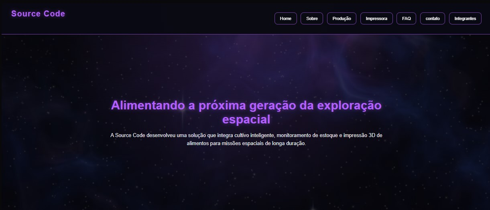
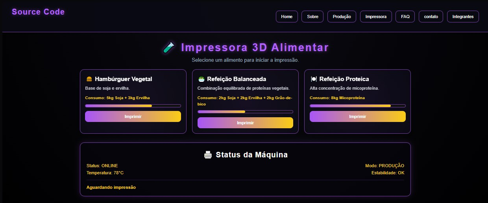
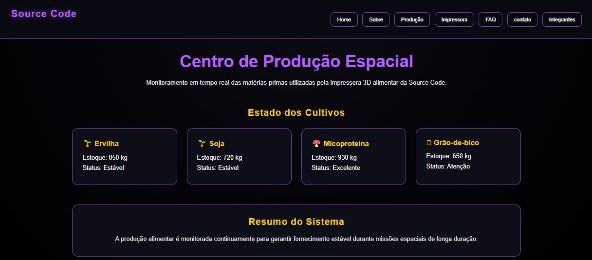
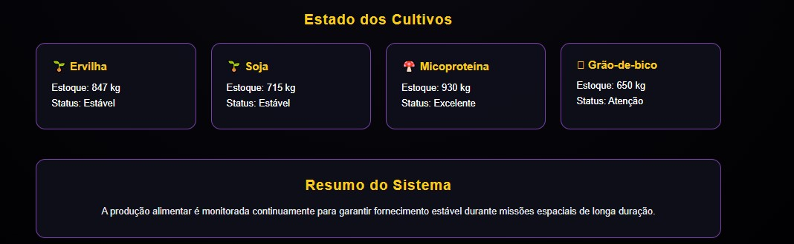

FoodPrint 3D | Source Code

O FoodPrint 3D é uma solução desenvolvida pela equipe Source Code com o objetivo de auxiliar a alimentação sustentável em missões espaciais de longa duração.

O sistema integra o monitoramento de matérias-primas, controle de estoque e uma impressora 3D alimentar capaz de produzir refeições utilizando ingredientes alternativos como soja, ervilha, grão-de-bico e micoproteína.

A plataforma foi desenvolvida para demonstrar como tecnologias digitais podem contribuir para a autonomia alimentar de astronautas durante futuras explorações espaciais.

/* ========== TECNOLOGIAS UTILIZADAS ========== * / 
React
Vite
JavaScript
HTML5
CSS3
Git
GitHub

/* ========== COMO UTILIZAR ========== * / 
primeiro entre na pasta pelo terminal cmd e colocque o codigo "NPM INSTALL" para puxar os arquivos necessarios para abrir em uma pagina web

Após a instalação dos nodes_modules voce devera ir novamente no cmd digitar o comando "npm run dev" 

Após isso você devera conseguir um link paracido com esse http://localhost:/ copie e cole no navegador
assim que o fizer aparecera a home principal 

a navegação devera ser feita pela nav bar logo acima 

Utilizando a impressora e produção 

a parte de produção está mais voltada a ser um estoque por enquanto, nela você pode ver quatos kgs de materia prima está disponivel
para impressão de alimentos 

Impressora 

Dentro da parte de impressora havera 3 opções sendo elas "hamburguer vegetal" "Refeição balanceada" e "Refeição proteica", todos eles terá a opção de imprimir logo abaixo deles  

apos utilizar nota-se que o que estava em produção tera sido utilizado

Antes:

Depois

/* ========== EQUIPE SOURCE CODE ========== * / 

Alexandre Prazeres
RM: 573059
Turma: 1TDSPO
Função: Desenvolvedor

GitHub:
(https://github.com/U-Ale)

LinkedIn:
(https://www.linkedin.com/in/alexandre-prazeres-santos/)

Matheus Nezio
RM: 571702
Turma: 1TDSPO
Função: Desenvolvedor

GitHub:
(https://github.com/Nezio22)

LinkedIn:
(https://www.linkedin.com/in/matheus-nezio-9971b0392/)

Júlia Rodrigues
RM: 571244
Turma: 1TDSPO
Função: Designer

GitHub:
(https://github.com/juliaraalmeida77-ux)

LinkedIn:
(https://www.linkedin.com/in/júlia-rodrigues-9147593a7/)

Link do Repositorio git:
https://github.com/U-Ale/Foodprint-space

